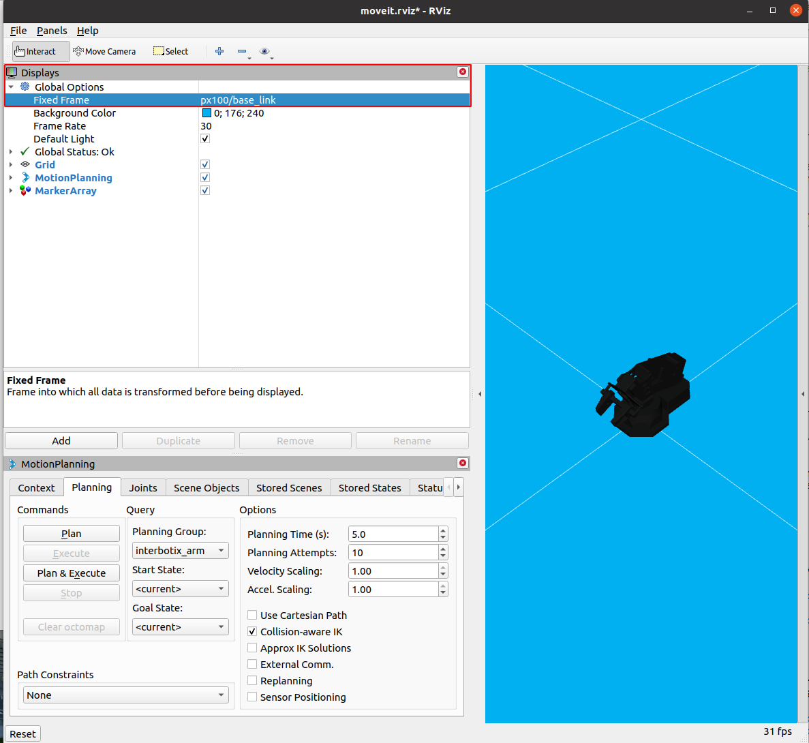
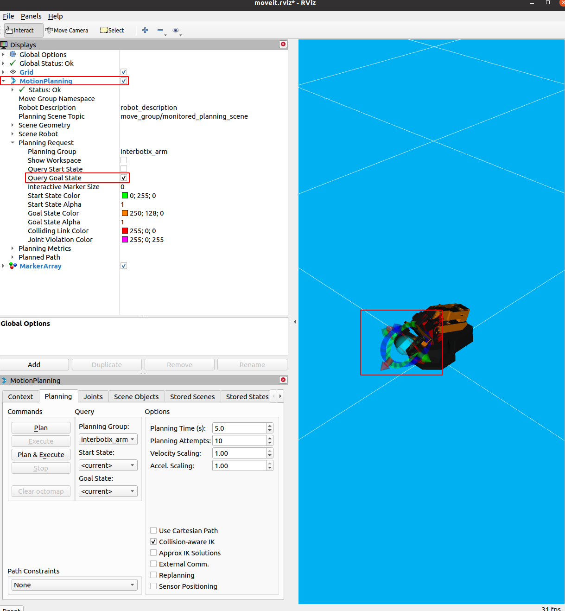

# Question

I heard that MoveIt may be a good way to get acquainted with the PX-100 arm. How
might I go about using it?

## Setup 

Check if you have Interbotix's ROS1 software package installed on your computer.
You can check if you do by executing

```bash
rospack list | grep interbotix
```

in your terminal. This should output the names of 20 or so packages that have
`interbotix_` as a prefix. If you see such output, you're good to go!

If your computer doesn't have Interbotix's ROS1 software package, navigate to
[this
page](https://docs.trossenrobotics.com/interbotix_xsarms_docs/ros_interface/ros1/software_setup.html#software-installation),
and follow the appropriate instructions to install the required software.

## Launching RViz with MoveIt

Next, execute this command to launch RViz with MoveIt:

```bash
roslaunch interbotix_xsarm_moveit_interface xsarm_moveit_interface.launch robot_model:=px100 dof:=4 use_actual:=true
```

Note the parameters: we are specifying that we want to use Interbotix's MoveIt
interface with the px100 which has 4 degrees of freedom. We are also stating
that we want to use MoveIt with the actual robot arm, rather than in simulation.

Once you execute the command above, go to the `Displays` window of RViz, and
change the `Fixed Frame` from `world` to `px100/base_link`, as pictured below:

<p align="center">
    <kbd>
        
    </kbd>
</p>

Next, again in the `Displays` window, click on the `MotionPlanning` tab and
ensure that `Query Goal State` is checked, like so.
 
<p align="center">
    <kbd>
        
    </kbd>
</p>

If you do this properly, you will see a small turqoise ball appear between the
robot's grippers, and arrows pointing to opposite directions on each of the x,
y, and z axes.

Now, try holding the top blue arrow with your mouse, and dragging it up, like
so:


<p align="center">
    <kbd>
        
    </kbd>
</p>

Then move to the `Planning` tab of the `MotionPlanning` window, and click `Plan
& Execute`.

<p align="center">
    <kbd>
        
    </kbd>
</p>

If all went well, you should have witnessed the MoveIt package plan a trajectory
to your arm's goal state, and move the arm accordingly!

## Next Steps

Reverse your steps to ensure the arm returns to a resting position. Otherwise,
make sure you have a colleague holding the arm before you exit RViz. This is
because once you exit RViz, the locks on the servo motors will shut off, and the
arm will come crashing to its floor! This probably won't damage your arm
permanently, but we still want to be as gentle with it as possible.

Playing with MoveIt in the way described above allows you to get acquainted with
the arm's rough workspace: what places it can reach, and what places it can't.
Of course, the next steps are to control the arm's movements through code that
you write. For this, see the entry on arm motion control in this faq.
