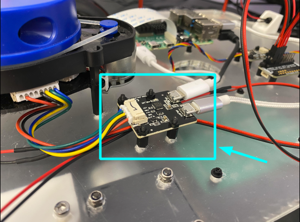
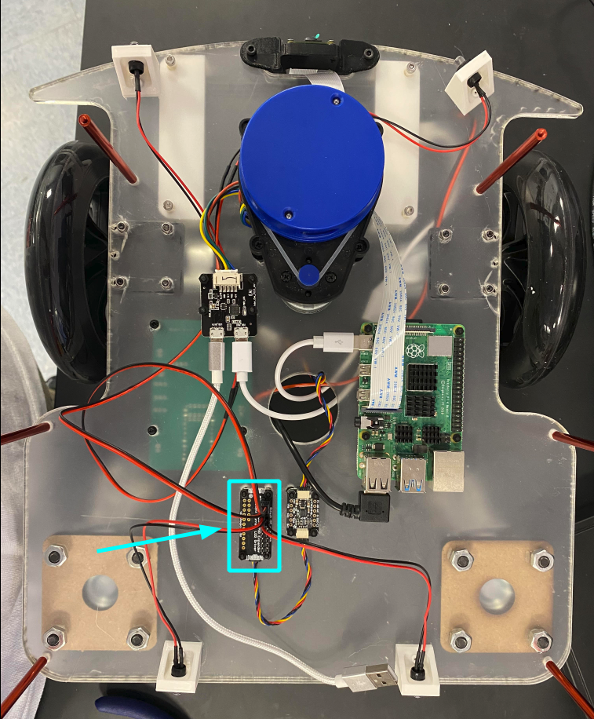
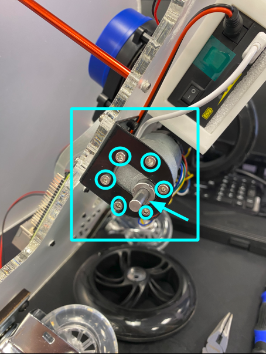
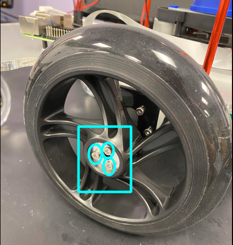
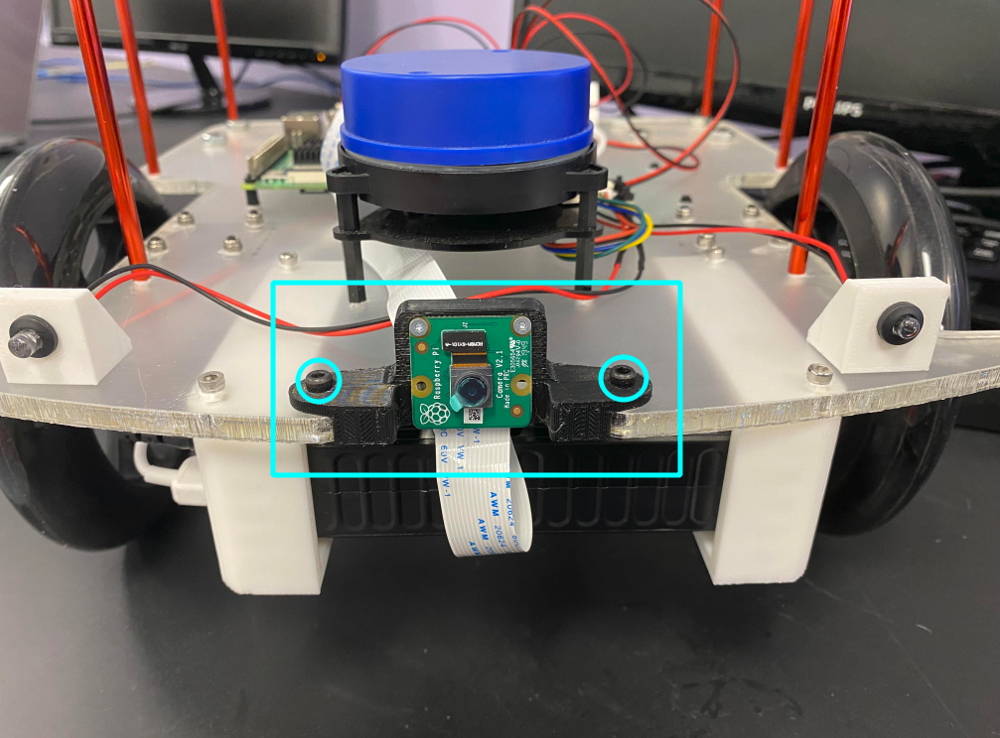
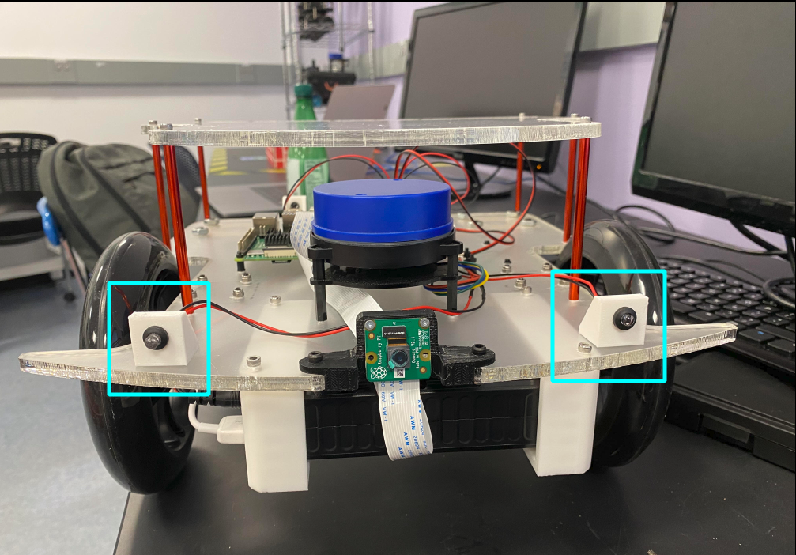
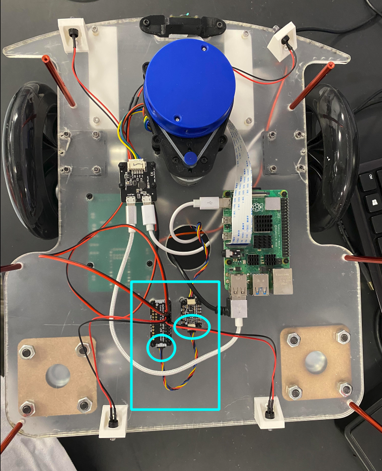
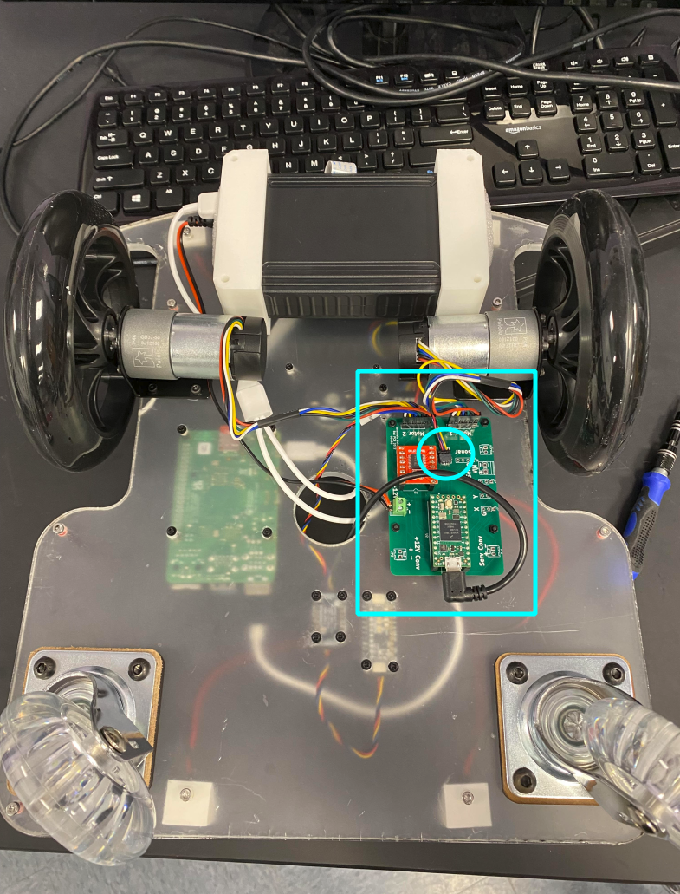
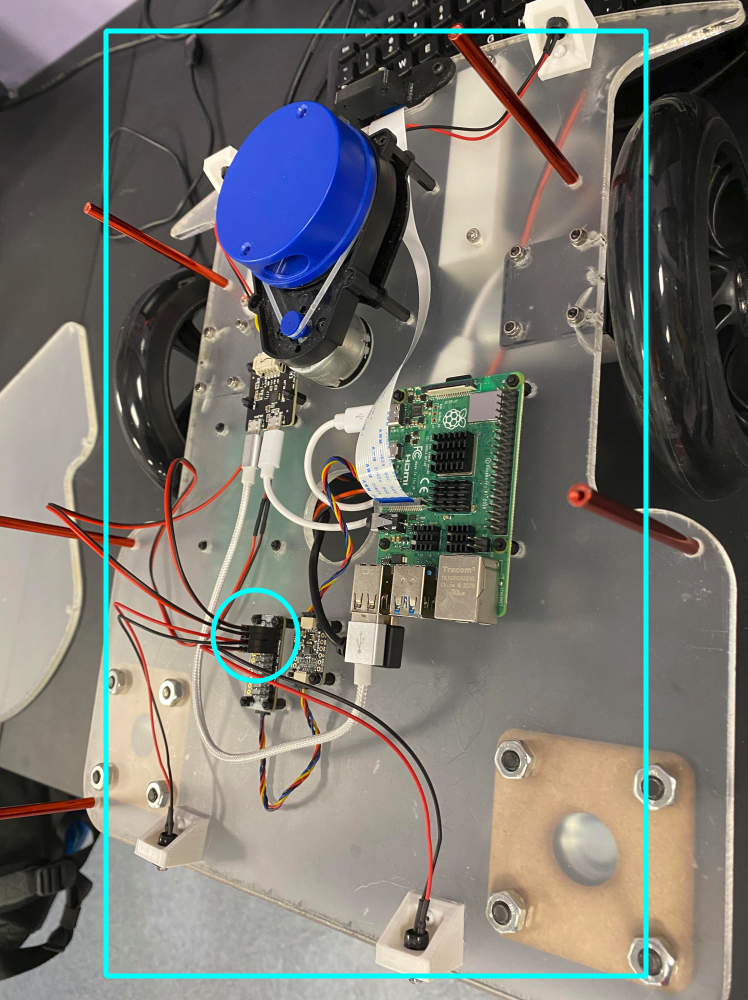

# BranBot Assembly Tutorial

## Introduction

This is a tutorial on how to assemble the BranBot from the [BranBot List of
Parts](https://docs.google.com/spreadsheets/d/1uRBRJOtii2d5AbC0FSu0Z_0Gutc6lYwzHgX9t3E3YAE/edit?usp=sharing).

'MakerLab' and 'Automation Lab' below refer to the organizations located in the
Brandeis Library.

__WARNING__: Always be careful with tools. Safety comes first!

---
## Overview of Instructions

- [Prepare Acrylic Frames](#prepare-acrylic-frames)
- [Attach the LIDAR to the Lower Acrylic Frame
  ('LAF')](#attach-the-lidar-to-the-lower-acrylic-frame-'laf')

---

## Prepare Acrylic Frames

1. Parts: Lower Acrylic Frame, Upper Acrylic Frame
2. Tools: Curved Nose Plier 
3. Steps:
    1. It's best to do this step in the Automation Lab, where a curved nose
       plier is readily available.
    2. Take a curved nose plier and punch through any incompletely drilled holes
       in the Lower and Upper Acrylic Frames.

## Attach the LIDAR to the Lower Acrylic Frame ('LAF')

1. Parts: LIDAR, 4 M2.5x6 screws
2. Tools: Screwdriver
3. Steps:
    1. Align the LIDAR to the correct holes on the LAF.
    2. Attach the LIDAR to the LAF with the 4 M2.5x6 bolts

    <kbd>
        
    </kbd>

## Attach the LIDAR Board to the LAF

1. Parts: LIDAR Board, 4 nylon M2 screws, 4 nylon M2 standoffs, 4 nylon M2 nuts
2. Tools: Screwdriver
3. Steps:
    1. Fix the 4 nylon standoffs to the appropriate holes in the LAF with the 4
       nylon M2 screws.
    2. Insert the LIDAR Board onto the nylon standoffs via its 4 holes.
    3. Fix the LIDAR Board onto the nylon standoffs via the 4 nylon M2 nuts.

    <kbd>
        
    </kbd>

## Attach the Charlie Board to the LAF

1. Parts: Charlie Board, 4 nylon M2 screws, 4 nylon M2 standoffs, 4 nylon M2
   nuts
2. Tools: Screwdriver
3. Steps:
    1. Observe that the Charlie Board should be attached to the underside of the
       LAF as in the picture below.
    2. Attach the Charlie Board to the LAF using the nylon screws, standoffs,
       and nuts (cf. the LIDAR board to LAF attachment instructions).
4. Notes:
    1. The Charlie Board should already have the Motor Driver, the Teensy, the
       Screw terminal, and the I2C right-angle connector soldered onto it. The
       terminal and the connector should have been directly soldered on. On the
       other hand, the Motor Driver and the Teensy should have male pins
       soldered onto them, which should have been inserted into female plugs
       that have themselves been soldered to the Charlie Board.
    2. If the above is not the case, ask the Automation Lab for assistance.

    <kbd>
        
    </kbd>

## Attach the Raspberry Pi to the LAF

1. Parts: Raspberry Pi, 4 nylon M2 screws, 4 nylon M2 standoffs, 4 nylon M2 nuts
2. Tools: Screwdriver
3. Steps:
    1. Find the appropriate holes in the LAF for the Raspberry Pi.
    2. Attach the Pi to the LAF using the nylon screws, standoffs, and nuts (cf.
       the LIDAR board to LAF attachment instructions).

    <kbd>
        
    </kbd>

## Attach the IMU to the LAF

1. Parts: IMU, 4 nylon M2 screws, 4 nylon M2 standoffs, 4 nylon M2 nuts
2. Tools: Screwdriver
3. Steps:
    1. Find the appropriate holes in the LAF for the IMU.
    2. Attach the IMU to the LAF using the nylon screws, standoffs, and nuts (cf.
       the LIDAR board to LAF attachment instructions).

    <kbd>
        
    </kbd>

## Attach the LED Driver to the LAF 

1. Parts: LED Driver, 4 nylon M2 screws, 4 nylon M2 standoffs, 4 nylon M2 nuts
2. Tools: Screwdriver
3. Steps:
    1. Find the appropriate holes in the LAF for the LED Driver.
    2. Attach the LED Driver to the LAF using the nylon screws, standoffs, and
       nuts (cf.  the LIDAR board to LAF attachment instructions).
4. Notes:
    1.  The LED Driver is the wrong side up in the picture below. So are the
        male pins that have been attached to it. This does not affect the
        functionality of the Driver, but attaching it the right side up is
        preferable.
    2. The LED driver should already have male pins soldered onto it. If it
       doesn't, ask the Automation Lab for assistance.

    <kbd>
        
    </kbd>

## Attach the Motor Brackets to the LAF

1. Parts: 2 Motor Brackets, 8 M3x11 bolts, 8 M3 nuts
2. Tools: Screwdriver, Plier
3. Steps:
    1. Align a bracket's four holes that form a square with appropriate holes
       in the LAF. 
    2. Fix the bracket to the Frame with bolts and nuts. It helps to hold a nut
       in place with a plier while screwing a bolt into it.
    3. Repeat for the other side.

    <kbd>
        
    </kbd>

## Attach the Motor Assemblies to the Brackets

1. Parts: Motor Brackets, 2 Motor Assemblies, 12 M3x6 bolts
2. Tools: Screwdriver
3. Steps:
    1. Ensure that the shaft of a Motor Assembly is positioned such that it
       occupies the lower portion of the large hole in a Motor Bracket. 
    2. Align the holes in the Motor Assembly with those in the Motor Bracket.
    3. Fix the Motor Assembly with the Motor Bracket using 6 M3x6 bolts.
    4. Repeat for the other side.
4. Note: The length of the bolts should be no longer than 6mm. Otherwise, they
   might interfere with the functioning of the gear box in the Motor Assembly.

    <kbd>
        
    </kbd>

## Attach the Wheel Adapters to the Motor Assemblies

1. Parts: 2 Wheel Adapters (thick parts, see picture below), 4 Stud bolts (these
   come with the Pololu wheel adapters, and are small headless bolts) 
2. Tools: Screwdriver
3. Steps:
    1. Find the flat edge of the shaft of a Motor Assembly.
    2. Insert a wheel adapter onto the shaft and rotate it such that the two
       holes on the adapter's side align with the mentioned flat edge. Ensure
       that:
       1. the shaft does not stick out through the adapter, but that the end of
          the shaft is flush with the adapter (cf. the picture below). 
       2. The thinner end of the thick wheel adapter faces outward (cf. the
          picture below).
    3. Insert two stud bolts into the two holes to fix the adapter to the shaft.
    4. Repeat for the other side.

    <kbd>
        
    </kbd>

## Attach the Fixed Wheels to the Wheel Adapters

1. Parts: 2 Wheel Adapters (thin parts, see picture below), 6 M3x20 bolts
2. Tools: Screwdriver
3. Steps:
    1. Insert a Fixed Wheel into the part of the Wheel Adapter that is attached
       to the Motor Assembly.
    2. Insert the thin part of the Wheel Adapter into the central hole of the
       wheel, ensuring that its three holes align with that in the thick part of
       the wheel adpater.
    3. Fix the thin part of the Wheel Adapter to its thick counterpart by
       inserting three M3x20 bolts into the three holes.
    4. Repeat for the other side.
4. Note: The length of the bolts should be no longer than 20mm. Otherwise, they
   might interfere with the rotation of the Motor Assembly's shaft. 

    <kbd>
        
    </kbd>

    <kbd>
        
    </kbd>

## Attach the Caster Wheels to the LAF

1. Parts: Caster Wheel Offsets, Caster Wheels, 8 M6x20 bolts, 8 M6 nuts
2. Tools: Screwdriver, Pliers
3. Steps:
    1. Use the pliers to remove the breaks from a Caster Wheel.
    2. Align the holes of a Caster Wheel Offset and those of a Caster
       Wheel to an appropriate set of holes in the LAF.
    3. Use hands to loosely fix the Caster Wheel Offset, the Caster Wheel, and
       the LAF via the M6 nuts and bolts.
    4. Use the plier to hold the nuts in place and the screwdriver to fasten the
       bolts into the nuts.
    5. Repeat for the other side.
4. Notes:
    1. The Caster Wheel Offsets are manufactured by MakerLab. 

    <kbd>
        
    </kbd>

## Attach the Camera to the Camera Mount

1. Parts: 2 M2x4 screws, Camera, Camera Mount
2. Tools: Screwdriver
3. Steps:
    1. Fasten the Camera to the Camera Mount with the screws.
4. Note: Camera Mounts are printed by the MakerLab.

    <kbd>
        
    </kbd>

## Attach the Camera Mount to the LAF

1. Parts: 2 M3x16 bolts, 2 M3 nylon lock nuts, Camera Mount
2. Tools: Pliers Screwdriver
3. Steps:
    1. Fasten the Camera Mount to the LAF using the bolts and nylon nuts. Hold
       the nylon nut in place with a plier when fastening the bolt. 

    <kbd>
        
    </kbd>

## Attach the Battery Brackets to the LAF

1. Parts: 2 Battery Brackets with heat-set nuts, 2 foam inserts, 4 M3x9 bolts
2. Tools: Screwdriver
3. Steps:
    1. Observe the orientation of the battery relative to the brackets in the
       pictures below.
    2. Insert the battery into the brackets, using the foam inserts to secure it
       in place. 
    3. Attach the battery to the LAF using the 4 M3x9 bolts
4. Notes:
    1. The battery brackets should already have heat-set nuts set into them. If
       this isn't the case, ask for assistance from the MakerLab.
    2. The MakerLab is also responsible for providing the foam inserts.

    <kbd>
        
    </kbd>

    <kbd>
        
    </kbd>

    <kbd>
        
    </kbd>

## Attach the LED Holders to the LAF

1. Parts: 4 M3x9 screws, 4 LED Holders
2. Tools: Screwdriver
3. Steps:
    1. Insert the LED bulbs/wires into the LED holders.
    2. Fix the LED holders to the appropriate holes in the LAF with the screws.
4. Notes:
    1. The LED Holders should have heat-set nuts melted into them. If they do
       not, ask for assistance from the Automation Lab.
    2. The LED wires should have bulbs on one end and female plugs on the other.
       If the female plugs are missing, ask for assistance from the Automation
       Lab.

    <kbd>
        
    </kbd>

    <kbd>
        
    </kbd>

## Wiring

### Connect the Raspberry Pi and the Teensy 

1. Part: USB 2.0 to Micro USB Right-Angle Connector.

    <kbd>
        
    </kbd>

    <kbd>
        
    </kbd>

### Connect the LED Board with the Raspberry Pi 

1. Part: USB 2.0 to Micro USB Cable.

    <kbd>
        
    </kbd>

### Connect the Raspberry Pi and the LIDAR Board to the Battery

1. Part: USB 2.0 to Micro USB and USB-C Splitter Charging Cable 

    <kbd>
        
    </kbd>

    <kbd>
        
    </kbd>

### Connect the Battery to the Charlie Board's Screw Terminal 

1. Part: Battery Power Cable

    <kbd>
        
    </kbd>

    <kbd>
        
    </kbd>

### Connect the LED Driver to the IMU

1. Part: I2C Cable
2. Note: The LED Driver is the wrong side up in the picture below. So are the
   male pins that have been attached to it. This does not affect the
   functionality of the Driver, but attaching it the right side up is
   preferable.

    <kbd>
        
    </kbd>

### Connect the IMU to the Charlie Board

1. Part: I2C Cable

    <kbd>
        
    </kbd>

    <kbd>
        
    </kbd>

### Connect the Motor Assembly's Wires to the Charlie Board

    <kbd>
        
    </kbd>

### Connect the LEDs to the LED Driver

    <kbd>
        
    </kbd>

    <kbd>
        
    </kbd>

### Connect the Camera to the Raspberry Pi

1. Part: Raspberry Pi Camera Ribbon Cable
2. Note: Observe how the ribbon cable twists as it goes from the pi to the
   camera.

    <kbd>
        
    </kbd>

    <kbd>
        
    </kbd>

## Attach the Standoffs to the LAF

1. Parts: 6 75mm standoffs, 6 M3x10 screws
2. Tools: Screwdriver
3. Steps:
    1. Attach the standoffs to the appropriate holes on the LAF with the screws.

    <kbd>
        
    </kbd>

    <kbd>
        
    </kbd>

## Attach the Upper Acrylic Frame to the Standoffs

1. Parts: 6 M3x10 screws
2. Tools: Screwdriver
3. Steps:
    1. Attach the Upper Acrylic Frame to the Standoffs with the M3x10 screws.

    <kbd>
        
    </kbd>

    <kbd>
        
    </kbd>

