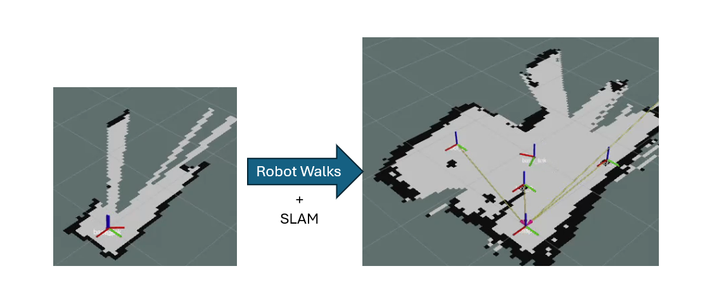
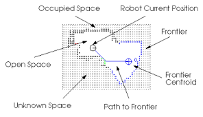
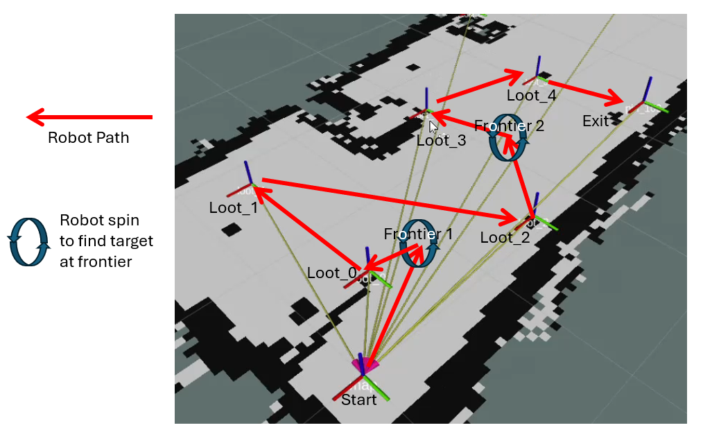

# Dungeons and Robot

**Yutian (Tim) Fan**: [yutianfan@brandeis.edu](mailto\:yutianfan@brandeis.edu)
## Introduction

### Problem Statement

The objective of this project is to enable a robot to autonomously map an unknown environment in real time without relying on a pre-existing map. While mapping the environment dynamically, the robot must also explore it autonomously, identifying and interacting with specific elements like frontiers and loot objects. This necessitated the use of SLAM (Simultaneous Localization and Mapping) combined with frontier exploration.

### Relevant Literature

The concept of frontier exploration and its implementation were sourced from Kai Nakamura's project on autonomous mapping robots, as detailed on the webpage: [https://kainakamura.com/project/slam-robot](https://kainakamura.com/project/slam-robot). Nakamura’s explanation of frontier exploration and associated code served as the foundation for integrating autonomous exploration in this project.


## What Was Created

### 1. Technical Descriptions and Illustrations

#### SLAM (Simultaneous Localization and Mapping)


*Figure 1: SLAM process visualized, with the robot dynamically mapping its environment as it explores.*

This project utilizes SLAM, specifically the GMapping package, which enables the robot to self-locate and construct a map of its environment in real time. The robot employs LIDAR to measure distances to surrounding objects, allowing it to infer its location relative to a global reference frame while simultaneously updating a map of its environment. This dynamic process ensures the robot can explore and navigate unknown environments efficiently without requiring a pre-existing map.

### 2. Discussion of Interesting Algorithms, Modules, Techniques



*Figure 2: The occupancy grid map generated by SLAM, showing explored, unexplored, and obstacle areas.*

1. **Frontier Exploration and Path Planning**
   - Frontier exploration identifies unexplored regions on the map and determines optimal paths to explore them.
   - The project employs a costmap-based path planner combined with the A* algorithm for generating efficient paths. The pure pursuit algorithm ensures smooth navigation along these paths by using a look-ahead point further in the path to reduce oscillation.

2. **Object Mapping with Camera and LIDAR Integration**
   - The camera processes images to detect objects marked with deep blue tape.
   - LIDAR measurements provide depth information to accurately position these objects in the map frame.
   - Fiducials (tags for marking points of interest) are detected and pinned in the map with their TFs continuously broadcasted. These techniques are inspired by the Fiducial Navigation PA and Line Following PA, integrated into this project for object detection and mapping.

3. **Exploration and Exit Strategy**
   - The robot alternates between exploring frontiers and collecting mapped loot.
   - When sufficient loot is collected or no frontiers remain, the robot navigates to an exit fiducial to complete the task.


### 3. Guide on How to Use the Code

Follow these steps to set up and run the project:

1. **Launch Gazebo Simulation** *(for simulation only)*:
   Start the Gazebo simulation environment with the TurtleBot3 and the pre-configured world:
   ```bash
   roslaunch dungeon_explorer turtlebot3_world.launch
   ```
   For real robots, instead of launching Gazebo, bring up your robot accordingly.

2. **Start SLAM**:
   Launch the GMapping package to begin SLAM. This initializes the `/map` topic, enabling the robot to self-localize and dynamically update the map:
   ```bash
   roslaunch turtlebot3_slam turtlebot3_gmapping.launch
   ```
3. **Launch RViz**:
   Start RViz for visualization. It is **crucial to manually launch RViz** instead of using pre-configured launch files to avoid algorithm conflicts:
   ```bash
   rviz
   ```
   In RViz:
   - Add the **map** under `/map`.
   - Add **TF** and select only the `map` and `base_link` frames.
   - Note that new TFs for loot and fiducials will be added automatically as they are broadcasted during the exploration process.

4. **Launch Fiducial Detection and Mapping**:
   Start the fiducial detection node to map fiducials and loot objects. This node will continuously broadcast TF frames for detected objects, making them accessible for path planning:
   ```bash
   roslaunch dungeon_explorer fiducials_real.launch
   ```
5. **Start Pure Pursuit**:
   Run the pure pursuit script to enable path-following functionality. This node listens for paths generated by the exploration loop and executes them to guide the robot along the planned trajectories:
   ```bash
   rosrun dungeon_explorer pure_pursuit.py
   ```
6. **Start the Frontier Exploration Loop**:
   Finally, initiate the high-level exploration loop. This script manages the entire exploration process, including loot searching, frontier exploration, and path planning. The loop runs until the robot finishes exploring or finds the exit:
   ```bash
   rosrun dungeon_explorer frontier_exploration.py
   ```

### 4. Names and Purposes of Components

#### **Python Scripts**
| **Script Name**        | **Purpose**                                                                 |
|-------------------------|-----------------------------------------------------------------------------|
| `frontier_exploration.py` | Contains the high-level exploration loop, including frontier exploration, loot searching, and path generation. |
| `mapper.py`             | Detects fiducials and objects, maps their positions, and broadcasts their TF frames. |
| `path_planner.py`       | Provides path planning utilities, including A* algorithm and C-space calculation. |
| `pure_pursuit.py`       | Implements the pure pursuit algorithm for smooth path following by the robot. |
| `my_odom.py`            | Adjusts and customizes odometry data for internal use. |
| `frontier_search.py`    | Searches for unexplored regions (frontiers) in the map and prioritizes them for exploration. |

#### **Topics and Their Messages**
| **Topic Name**            | **Message Type**       | **Purpose**                                                                 |
|---------------------------|------------------------|-----------------------------------------------------------------------------|
| `/pure_pursuit/paths`     | `dungeon_explorer/PathList` | Sends the list of paths for the pure pursuit node to execute.               |
| `/cmd_vel`                | `geometry_msgs/Twist` | Sends velocity commands to control the robot's movement.                   |
| `/finished_paths`         | `std_msgs/Bool`       | Indicates whether all paths have been completed.                           |
| `/odom`                   | `nav_msgs/Odometry`   | Provides odometry data for robot localization.                             |
| `/map`                    | `nav_msgs/OccupancyGrid` | Provides the current map for path planning and frontier exploration.       |
| `/mapper/max_id`          | `std_msgs/Int32`      | Publishes the ID of the most recently detected object.                     |
| `/pure_pursuit/enabled`   | `std_msgs/Bool`       | Enables or disables the pure pursuit functionality.                        |
| `/pure_pursuit/lookahead` | `geometry_msgs/PointStamped` | Publishes the lookahead point for the pure pursuit algorithm.             |

#### **Custom Messages**
| **Message Name**   | **Fields**                                                                                  | **Purpose**                                                 |
|---------------------|---------------------------------------------------------------------------------------------|-------------------------------------------------------------|
| `Frontier.msg`      | `geometry_msgs/Point centroid`, `float32 size`                                             | Represents a single frontier detected during exploration.   |
| `FrontierList.msg`  | `dungeon_explorer/Frontier[] frontiers`                                                    | Contains a list of detected frontiers for exploration.      |
| `PathList.msg`      | `nav_msgs/Path[] paths`                                                                    | Represents a list of paths for the pure pursuit node.       |

## 3. Story of the Project

This project started with a very ambitious idea. I wanted to create a game-like experience where a human could design a dungeon for a robot to explore. The robot would use SLAM to discover the map step by step, similar to how a player uncovers a map in a video game. My original plan included two types of objects: monsters and loot. The robot would recognize these objects using deep learning-based computer vision. A robot arm would pick up loot and knock over monsters, and the robot would eventually find its way to an exit fiducial.

But being a solo project, I had to scale things down quickly. Time was limited, especially with much of my semester dedicated to graduate school applications. The first compromise was to drop deep learning-based computer vision. Training a model wasn’t realistic, and running it on a Raspberry Pi would likely fail. I decided to focus on only one object type instead of distinguishing between monsters and loot. The robot arm idea was also cut, as it wasn’t reliable enough to depend on for the final presentation. Instead, I decided the robot would only navigate to loot objects and treat interaction as reaching their location.

Next, I had to refine how the robot would explore. I initially thought of navigating to the centroids of unexplored areas, but I quickly realized this wouldn’t work—unexplored space is effectively infinite. After some research, I found Nakamura's frontier exploration algorithm, which uses boundaries between explored and unexplored areas. This approach fit much better with the occupancy grid provided by SLAM, which represents unknown, free, and occupied spaces as -1, 0, and 100, respectively.

Another challenge was object localization. My original idea was to use a depth camera, which would provide straightforward measurements. But I discovered that most depth camera tutorials are for ROS2, and ROS1 options lacked detailed guides. After spending a week troubleshooting, I switched to my backup plan: using a regular camera to align the robot with an object and LIDAR to measure the distance. This allowed me to map objects by combining LIDAR distance with the robot’s position in the map frame. To simplify the setup further, I replaced monsters with tall blocks wrapped in blue tape to represent loot.

Once the plan was finalized, I started implementing the project. I learned a lot more about ROS, like how topics, TF buffers, and nodes work together. I also had to explore new concepts like custom messages and building a custom Gazebo simulation. It wasn’t smooth sailing—debugging and fine-tuning took time—but I made steady progress.

In the end, the project didn’t always work perfectly due to the robot’s physical limitations, but I’m happy with how far it came. This project taught me the importance of adapting to constraints and coming up with backup plans. It also reinforced how much progress comes from consistent effort—without a solid understanding of earlier assignments, especially the line_follower PA, fiducial_nav PA, and tf tutorials, I wouldn’t have been able to complete this project on my own.


*Figure 3: Visualization of the robot navigation in the level.*
