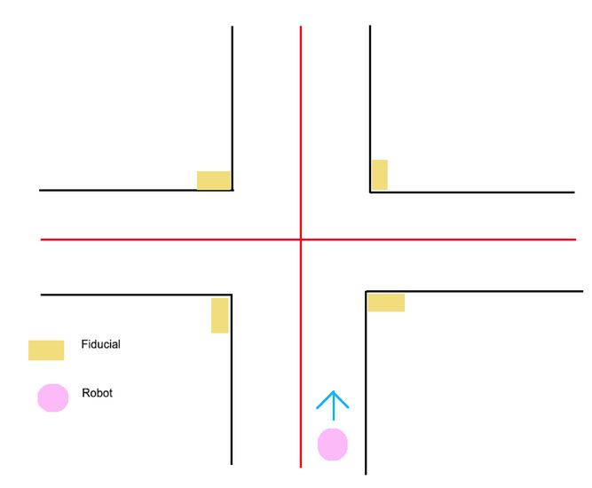
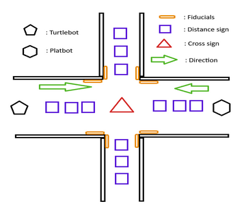

# Right-of-Way System of Robots & Yielding

A ROS Robot  Project

GitHub Link: https://github.com/1192119703jzx/Right-of-Way-System-of-Robots-Yielding

Also check FAQ, Setting the Camera Parameters section.

## Team Members

- **Haochen Lin**  
  Email: haochenlin@brandeis.edu

- **Zixin Jiang**  
  Email: zixinjiang@brandeis.edu


## Inspiration

The idea of this project comes from the real-world cross-road scenario and right-of-way problem. In the real world, it is very confusing to decide who has the right of way when you reach a crossroad with 4 stop signs on each side. Typically, people will waive their hand when they can’t tell who arrives first and has the right of the way. If we can build a scenario in which a central system controls the traffic and the right of way. It gonna be a monumental mark to auto-drive technology.

## Work Distribution: 

Scheduling and communication (Haochen Lin).
Robot movement and Fiducial recognition (Zixin Jiang)


## Project Overview

This project simulates a real-world right-of-way system for robots navigating an intersection. The system is inspired by traffic scenarios where determining the right of way can be challenging. It employs a central scheduler to manage robot movement, mimicking real-world traffic flow and promoting advancements in autonomous driving technology.


## Problem Statement

This project focuses on creating a logic system for robot communication and navigation at intersections. Two robots approach the intersection from different directions and determine the right of way based on their arrival times, mimicking real-world traffic scenarios. Priority can also be adjusted based on predefined identities or emergency statuses. Fiducials, placed at four corners of the intersection, provide location information for the robots via their cameras, enabling recognition from the opposite direction without obstruction.


## Running Logic



---

- The robot starts from the beginning of the map and starts to move forward.
- Upon reaching the intersection, the robot stops in front of the intersection. The robot will publish a message to the scheduling node, indicating its presence along with its relative location in the intersection and its future plan.
- The scheduling node applies a "first come, first go" rule, optionally taking robot positions into account, and informs each robot when it is its turn to proceed.
- When the robot receives the signal from the scheduling node, it enters the intersection. When it leaves the intersection, it also sends a message to the scheduling node, indicating it has left such that the scheduling node can let other waiting robots process.


## Map Setup

Our real crossroad map setting

1. The intersection scenario is set up on a large white paper, serving as the test map for all experiments. White paper can make the colored line more obvious and easy to detect.
2. The intersection is built with black and red lines. Each road is divided into two ways, the right way for the forward direction, and the left way for the opposite direction.
3. Four fiducial blocks are placed at four corners of the intersection. For each direction, a block is placed in the left corner right next to the black line. A fiducial with a unique ID is stuck on the block.
4. The robot will be placed at the right side of the two-way road, mimicking the real-world right-hand side traffic.


---

## Key Features Break Down

### Multi-Robot System

Used function:
```bash
$ roslaunch turtlebot3_bringup turtlebot3_multi_robot.launch
or
$ roslaunch turtlebot3_bringup right2.launch
```
The Project runs multiple robots at the same time. By signing one robot to another robot’s IP, we can control two robots at the same time. However, due to environmental limitations, we can not run more than two robots since we don’t want to interrupt others by corrupting the robot when we sign it to another robot.
In this case, we have the main robot robA as the master robot, and Rafael as the follower robot. By the launch muti_robot_launch in the follower robot, both robots can take the same move or different depending on the actual launch file setup.


### Scheduling Stages

- **Entering**: Robots move toward the intersection.
- **Waiting**: Robots queue in the scheduler.
- **Passing**: Robots cross the intersection when permitted.
- **Left**: Robots signal departure, allowing others to proceed.

Each robot is split into 4 stages: Entering, Waiting, Passing, and Left. Initially, all robots were in the “Entering” stage which means they would move until they reached the cross. Then, they will turn into “Waiting” stage. The robot in the waiting stage will be stored in a queue in scheduler.py After all robot enters the queue. The scheduler will send a signal to the first robot which turns its stage to Passing. In the passing stage, the robot will perform cross-road action, and then enter the “Left” stage. The robot in the “Left” stage will be removed from the queue which allow the following robot to do a cross-road action similar to the above until all robots leave the queue. Theoretically, we can run as many robots as we can if there are enough robots available.


### Navigation Challenges & Solutions

#### We need the robot to move along the center of the space between the red and the black lines
#### Difficulty: 
Lighting Inconsistency: Room illumination varies unpredictably. Sometimes extreme darkness can cause camera failure in red line detection. Thus, we need to establish stable environmental conditions to ensure consistent camera performance across different lighting scenarios.
Camera Quality Variability: Camera specifications differ between robots We want to develop a universal Python control script for convenience. Thus, we seek a generalized solution adaptable to all robot units to ensure robust camera performance regardless of individual hardware differences.
#### Solution: 
Turn on all the lights in the room when testing. (of course!)
We customize each robot's camera parameters (contrast and brightness) through launch file modifications, enabling universal detection of red and black lines using standardized color range configurations in our code. See the FAQ section for more details on how to configure the robot’s camera parameters.
#### Limitation:
Our map, created on large and thin white paper, presents surface irregularities that cause reflective challenges. These uneven surfaces result in significant light reflection, which artificially brightens the black color and compromises detection accuracy.
#### Implementation:
We convert the camera callback image from BGR to HSV color space and create a mask to detect red regions. And then we extract a slice of the mask to find a red line in front of the robot. Depending on the robot's current stage and plan, it adjusts the region of interest for line detection. We calculate the centroid of the detected line and update flags indicating whether the line is detected. The centroids are used to guide the robot's navigation. We do the same thing for the black line and get the centroid for black. Implementing PID control with the proportional part only for stabilization reasons. We calculate the current error using the formula: (w / 2 - r + (b - r) / 2)) / 100, where: w = image width, r = red line centroid, b = black line centroid.
#### We need the robot to stop in front of the intersection.
#### Failure Stopping Mechanism at Intersection: 
Stop when the right-hand side black line is no longer detectable.
Place a green stop line at the intersection entry point. Program the robot to halt when the stop line appears in the lower camera image region.
#### Reason for Failure:
Camera placement challenges create a critical detection limitation: mounted vertically at the robot's top, the camera can only view the front floor, missing the area directly underneath. This positioning causes the robot to halt approximately 20 cm before an intersection when the green line or right-hand black line becomes undetectable at that point. Attempting to tilt the camera downward results in an excessively dark callback image due to automatic camera exposure adjustment and it is impossible to detect the fiducial from that angle.
#### Solution:
Utilize fiducial markers to precisely measure distance. Initiate marker detection at the onset of movement. Selectively store only fiducials facing the robot by calculating the rotation of the fiducial. Save the frame of the fiducial to a pin frame in the tf tree to prevent loss of the fiducial frame when it is detectable. Continuously monitor the distance between the robot's base_link and the pinned fiducial frame by calculating the distance at the beginning of every loop. Halting movement when the distance falls below the predetermined target threshold. 
#### We need the robot to go ahead, turn right, turn left in the intersection. 
#### Go Ahead:
Implementation: When the right-side black line becomes undetectable, navigation relies solely on the left-side red line using PID control (only proportional part). The current error is calculated as (w / 2 - (r + x)) / 100, where w represents image width, r denotes the red line centroid, and x is a predetermined threshold for the center of the way.
	Difficulty: The previously used image slice reveals a horizontal red line that risks misguiding the robot into an unintended rightward turn. To ensure accurate navigation, the system must selectively capture only the vertical red line while filtering out the potentially misleading horizontal line.
	Solution: When the stage transitions from "moving" to "crossing", the sliced region of the callback image shifts from the lower to the middle part (slice 2). We calculate the centroid of red using slice 2. When both red and black lines become detectable in slice 1, the robot reverts to the "moving" stage and signals the scheduling node of its departure.
#### Turning Right:
Implementation: When the right-side black line becomes undetectable, navigation relies solely on the left-side red line using PID control (only proportional part). The current error is calculated as (w / 2 - (r + x)) / 100, where w represents image width, r denotes the red line centroid, and x is a predetermined threshold for the center of the way. We use still use the old sliced region of the callback image which captures the lower part (slice 1). There is only a horizontal red line in this slice region which will guide the robot turning rightward. The predetermined threshold x must be bigger than the center of the way such that the amplitude of rotation is large enough for turning the robot 90 degrees. When both red and black lines become detectable, the robot reverts to the "moving" stage and signals the scheduling node of its departure.
#### Turning Left:
Failure Mechanism to Turn Left: Maintain a constant angular and linear speed for the robot to execute a circular motion with a predefined radius matching the intersection's dimensions on the map. 
#### Reason for Failure:
The pre-determined movement proves unreliable, failing to adapt to intersections of varying sizes and geometries. Dynamic path adjustment becomes essential to accommodate diverse intersection configurations.
#### Solution:
 The solution involves dynamic adjustment using the fiducial marker during the navigation process. While in the "moving" stage, the system stores the detected fiducial marker in a pin frame within the tf tree. The initial step is to calculate the arctangent angle between the base link and the pin frame. The robot then rotates to face the fiducial marker by turning through this calculated angle. Subsequently, the system continuously calculates and monitors the distance between the base link and pin frame during each iteration. The robot progresses forward until this distance falls below a predetermined threshold. Upon stopping, the robot initiates a left turn until both red and black lines become detectable. Once these conditions are met, the robot transitions back to the "moving" stage and signals the scheduling node to indicate its departure.


---

## Program Structure
For script, each robot has it's own sciprt to deal with data seperately

- **Launch Files**:
  - `fiducial.launch`: Detect fiducial markers.
  - `communicate.launch`: Manage robot communication.
- **Scripts**:
  - `road_follower.py`: Control robot movement.
  - `fiducial_dist.py`: Handle fiducial detection and distance calculations.

---

## How to Use

1. Start fiducial detection:
   ```bash
   roslaunch fiducial.launch
   ```
2. Run the communication module:
   ```bash
   roslaunch communicate.launch
   ```
3. Reset fiducials before each run to maintain accuracy.

---
Firstly, run fiducial.launch in the background, then run communicate.launch when fiducial is running. Both launch file ensures two robots run simultaneously, and you don’t have to run extra steps. However, it is worth noting, that you should reset fiducial every time you relaunch the communicate.launch. Otherwise, the accuracy may reduced significantly.

## Results

So, how’s the outcome?
Due to the limitation of robot hardware, we can only run two robots at the same, but it is good enough to verified our concept. Now in our designed map, two robots can run as scheduler-managed. There are some delays that could potentially be caused by running two robots on the same roscore, but overall it perform everything the scheduler plans.

---

## Abandoned Concepts

Originally, the project was more focused on recognizing different types of robots such as Platbot or tanks using Lidar or a camera. However, this idea is abandoned since neither is efficient enough to give precise information about which type of robot it is. 
Moreover, the map that we made is too small for a robot like Platbot to pass through, and the Platbot has various problems when we try to implement it to our function because of its size and the method that it operates. 
Eventually, it leads to signaling information exchange. The information is not only accurate but also avoids the limitations of the robot.


What’s more, the original plan actually doesn’t involve two lines but only one road, which means each robot might need to run a little bit further from the road to avoid conflict. It is eventually abandoned because the robot isn’t sensitive enough to keep a safe distance from each other.



The beginning map concept (Abandoned)

At last, it is pretty sad we can only run two robots within the same terminal due to budget limits and time constraints. Since each robot has its independent “bashrc”, it will require us to manually change the setup in each robot. In other words, we hack those robots thus others can’t really use them. Nevertheless, two robots might be efficient enough to finish signed tasks.


---

## Conclusion

This project demonstrates the feasibility of a scheduler-based right-of-way system for robots. With better hardware, the concept can scale to larger traffic scenarios, paving the way for advancements in autonomous navigation.

---

## References

- [ROS Official Tutorials](http://wiki.ros.org/ROS/Tutorials)
- [Campus Rover Lab Notebook](https://campus-rover.gitbook.io/lab-notebook/fiiva/spawn_multiple_robots)

---

## GitHub Repository

Explore the full code and documentation here: [GitHub - Right-of-Way System](https://github.com/1192119703jzx/Right-of-Way-System-of-Robots-Yielding)


#### Thanks for the help from everybody in the 119 Robot Lab. 