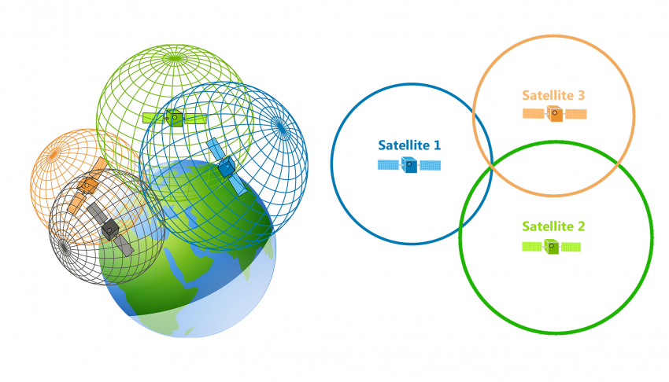
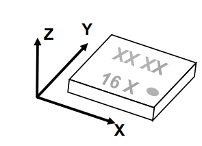
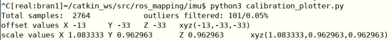

---
title: Starship Delivery Robot Clone
author: Ephraim Zimmerman, Zach Hovatter, Artem Lavrov
date: Dec 10 2024
—--

[Github Repo](https://github.com/EphraimJZimmerman/ros_mapping)

## Team Members
Ephraim Zimmerman - ezimmerman@brandeis.edu
Zach Hovatter - zhovatter@brandeis.edu
Artem Lavrov - artemlavrov@brandeis.edu

## Introduction

The goal for this project was to build a clone of the Starship robots found on the Brandeis campus. These robots are capable of navigating along the campus sidewalks autonomously, with the goal of delivering food (that was placed inside of it by a human). While it wasn’t feasible to do the latter, we were able to build a robot with autonomous, outdoor navigating capabilities. The key topics in the below description highlight the difficulties of localizing the robot in real time, having it navigate to nodes, as well as stay in a desired path during its traversal. The only major component not included in this that we originally planned on was obstacle avoidance. However, we later learned that Starship robots also do not contain any obstacle avoidance capabilities, they simply stop moving when confronted with such a problem. As such, our original goal still holds strong. 

## How the code work and how to use it

### What sensors does the robot use and how do they work?
For this algorithm, the robot uses two sensors: a GPS and a magnetometer. The GPS is used for absolute position data and the magnetometer is used for absolute orientation/heading. Using a combination of these two sensors, the robot can navigate outside by checking whether it has reached a certain set of coordinates and being able to check if it is facing the right direction to go to the next set of coordinates. 

There are many better resources to find out how these sensors work in detail, but we will give a brief overview of how they work here. 

The GPS works by communicating with at least 3 satellites. The satellites send the GPS their position data and a timestamp, which the GPS chip then uses to calculate the distance of the GPS chip from the satellite. With at least 3 satellites, you get three spheres of possible positions of the GPS receiver. This is because you know the center of the sphere (the position of the satellite) and the radius of the sphere (the GPS receiver’s distance from the satellite). If you take the intersection of two of these spheres, you get a 2 dimensional circle of all the possible positions where the GPS receiver could be. If you take the intersection of these 3 spheres you get 2 possible positions where the GPS receiver could be . If you assume the GPS receiver is on the surface of the Earth, you can use the Earth as a fourth sphere and calculate the intersection of this sphere with the other 3 spheres to get a singular position where the GPS receiver could be. Typically a fourth satellite is also used to adjust for small errors in timestamps that are being received from the other 3 satellites. That is the essence of how the GPS determines its position on the earth. 

 

The magnetometer works by measuring the magnetic field of the earth relative to itself. More specifically, it measures the strength of the magnetic field in each direction relative to itself. Our robot uses a 3 axis magnetometer, meaning it measures the strength of the magnetic field in the direction of the x,y, and z axes. You can see how these axes are positioned relative to our magnetometer in the diagram below. The issue with magnetometers is that they often need to be calibrated because various materials can interfere with the magnetic field of the Earth and thus with their readings, but these can be accounted for. This is what you are doing when calibrating a magnetometer, accounting for these interference with the magnetometer.




### How does the robot localize and move across space? 
Although there is a determined map recorded as a set of coordinates (lat/lon) along a path, the nature of the robot is still autonomous in its ability to pathfind and navigate to these points. The robot uses a breadth search first algorithm (BSF) to find the optimal path between nodes. The nodes themselves are labeled with a string name, and their metadata contains lat/lon coordinates, as well as the nodes they are connected to via undirected edges. This edge system, however, is *not* what the robot follows to navigate to the next node, it is to inform the BSF algorithm of the interconnectivity of the nodes for ease in path following. This was an interesting challenge but yields more creativity in the physical locations a robot can be placed. To navigate to the next node, a function was built to calculate the necessary turn rate to arrive at the next node from the node it resides in. We also use something called the “haversine function” to calculate the distance between two lat/lon points in meters. This is primarily used to localize the robot, specifically, this is most important on bring-up, since the robot needs to know which node it is currently residing in and what it’s facing. 

### Configuring the Graph
The graph was built in Python without using any external libraries. The nodes themselves are stored in a list of tuples, with lat/lon values. The edges exist inside of a dictionary mapping nodes to a list of connected nodes. The nodes are specified as lat/lon values, but you can also generalize them by using a separate dictionary where the key is some string value (like “home”, or “oustide_lab”). The nodes are grabbed from Google Maps and local GPS data and have a threshold distance for arrival, currently set as 1 meter (to allow for some error). The key way to understand how coordinates are created is to think about *at least* adding a node wherever the robot needs to change direction. However, not having a node, even on a straight line for a significant distance may cause other issues, such as the robot not being able to find the node as it went too far in one direction. Since this structure is so dynamic, the robot could theoretically move in any shape (square, circle, octagon, etc.)


### Bringing up the robot and checking if it is working properly
There is a custom bringup for this project in the ros_mapping package. It requires the sodacan package and all of its dependencies in order to work. In order to run the bringup, first bring the robot outside and wait until your GPS is actively receiving messages from satellites. Then run 
```bash
roslaunch ros_mapping bu.launch
```
Wait until the first imu message is received and make sure there are no errors within the bringup. It is also recommended to make sure the magnetometer is calibrated properly by running
```bash
rosrun ros_mapping mag_reader.py
```
and seeing if the degree values from some other compass (like your phone compass) match up approximately with the magnetometer degree values. If there is a significant difference between these values, you may want to recalibrate the magnetometer. If not, you can skip the next section. 

### Calibrating the Magnetometer
To calibrate the magnetometer,  first you need to collect a lot of raw magnetometer values. I have written a script to do this. All you have to do is run:
```bash
./mag_logger.py > <file name>.csv
```
and enter the name of the file into the constant called “DATA_FILE” in the calibration_plotter.py file. It should be at the start of the file and look like the code below:

```python
# Make sure to install pandas, numpy and matplotlib before running this script,  it should run automatically under jupyter notebook
import pandas as pd
import matplotlib.pyplot as plt
import matplotlib.cm as cm
import numpy as np
from matplotlib.colors import LinearSegmentedColormap
from io import StringIO

DATA_FILE = "magnetometer_outside.csv"  # Change this to your actual file name

# Be sure to remove your outliers and check the data to see if it looks correct. ideally there should not any dots far from the "circles".
# Percentage of outliers to remove from the top of the data, increase adjust until you data looks cleaned.
my_top_percentile = 0.025
# Percentage of outliers to remove from the bottom of the data
my_bottom_percentile = 0.025
save_plots_to_file = True   # Set to True to save the plots to a file
# Adjust if need to plot faster, 1.0 = 100% of the data, 0.5 = 50% of the data, 0.1 = 10% of the data, etc.
plot_sampling_percentage = 0.2
figure_size = (10, 10)  # Adjust the size of all the plots, (width, height)
```

Make sure to replace magnetometer_outside.csv with your actual file name with the data you recorded in the previous step. At this point you should be able to run the calibration_plotter.py file like so:
```bash
python3 calibration_plotter.py
```
and this script will bring up a bunch of matlab plots (which are interesting to look at for visualization of what the script is actually doing and how it is calibrating the magnetometer, but not actually important to understand for this step). You can ignore the plots and look at the values printed to the console. They should look something like this:

.

You want to copy the offset and scale values in the xyz() parentheses and paste them into the constants called “OFFSETS” and “SCALES” in the mag_corrector.py file respectively. The start of the mag_corrector.py file should look something like this after that:

```python
#! /usr/bin/python3
import numpy as np
from sensor_msgs.msg import MagneticField
from geometry_msgs.msg import Vector3
import rospy
from collections import deque

'''Calibration Params'''
# Replace with the offset values you get from calibration_plotter.py
OFFSETS = [-13, -33, -33]
# Replace with the scale values you get from calibration_plotter.py
SCALES = [1.083333, 0.962963, 0.962963]

''' Median Filter Params '''
# Adjust this to increase the buffer size for the median filter.
# Increasing will reduce noise, decreasing will increase noise.
WINDOW_SIZE = 20

# Create buffers for median filter
x_buffer = deque(maxlen=WINDOW_SIZE)
y_buffer = deque(maxlen=WINDOW_SIZE)
z_buffer = deque(maxlen=WINDOW_SIZE)
```

After you’ve completed all these steps, make sure these changes are present on your actual robot, and you can bring up the robot again and run the mag_reader.py script and your robot should be reading proper degrees that should approximately line up with your other compass (but they are not accounting for magnetic declination so they might be slightly off, that is normal). 

If there are still issues, there are likely magnetic substances in your environment that are throwing off the magnetometer readings, and you should move your robot to a new environment if possible. If that is not possible, try removing possible sources of magnetic interference. 

After all that is done, we can finally run the actual code. This is thankfully much simpler. All you have to do is run:
```bash
roslaunch ros_mapping takeoff.launch
```


### Description of the primary nodes
1. gps_reader.py  
    Parses raw data from the configured GPS sensor and converts it to a more usable format, and publishes this data as a NavSatFix message to the topic /gps.
2. mag_corrector.py  
    Parses raw data from the configured magnetometer and applies the hard and soft iron correction (as determined by the calibration process) to correct the data, and publishes it as a MagneticField message on the /imu/mag_corrected topic.
3. navigate_to_destination.py  
    This node is where the graph logic is contained. It subscribes to the /gps and /imu/mag_corrected topics. The graph must be populated manually with the latitude and longitude values for each node, and the edges for each node must also be specified. The user can then set a start and end node and BFS will be used to determine the shortest navigation path between those nodes. This program constantly checks the GPS position of the robot and publishes the desired heading that must be maintained to reach the next node in the specified navigation path as a Float64 message to the /robot/bearing topic. Once the robot gets within a 3 meter distance of the location specified in a graph node, the program publishes the heading needed to travel to the next node in the path and so forth until the last node in the path is reached. 
4. mag_follower.py  
    This node subscribes to the /robot/bearing and /imu/mag_corrected topics and handles the navigation between graph nodes. Once the node receives a new target bearing from the /robot/bearing node it publishes to /cmd_vel to turn to that bearing and starts moving toward the next graph node. A PID control is used to ensure that the robot follows the desired direction, allowing it to correct itself when going off course due to bumpy segments of road.

## Story of the project. 
### How it unfolded 
The initial motivation for the project was to better understand the types of algorithms and considerations used when programming an outdoor autonomously navigating robot by replicating the functionalities of a Starship delivery robot. 

At first we planned on combining the navigation of the robot with a web interface that could send “orders” to the robot, telling it where to navigate, but we ultimately decided to focus solely on the navigation portion of the system, which had plenty of challenges to tackle.

The first outlines of our project required a full map of campus which would make navigation much easier, assuming the GPS was accurate enough. However, we decided that this mapping process would take too much time and would be of questionable accuracy anyways due to our limited resources, so we pivoted to using waypoint-based localization that uses a graph populated with a few important gps locations and navigational data corresponding to each next node in the graph. While we were unsure about the accuracy of this solution at first, we quickly gained confidence in this method after correctly configuring the GPS sensor and verifying the accuracy of its readings. 

After deciding on waypoint-based navigation, we only needed to decide on a method of navigating the robot to and from each waypoint, as the robot wouldn’t be localized while travelling between nodes in the graph. At first we considered using computer vision to detect where the sidewalks were, allowing it to simply follow the sidewalk until reaching the next node, however this proved to be difficult, so we pivoted to relying on magnetometer data which allows the robot to know its real bearing and ensuring that there are enough graph nodes such that a safe straight path can be made between any two nodes and using the bearing between such two nodes to inform the robot on what direction to travel. 
### How the team worked together
Given that we have three members, we split up the project into its three main problems. Ephraim worked on designing the graph object that would serve as our waypoint-based ‘map’ and populating it with data.

Artem worked on sensor fusion, and ensuring that the sensors we needed were calibrated correctly, giving accurate data, and ensuring that the readings were consistent across sensors giving similar types of data.

Zach worked on the navigation algorithm that allows the robot to move safely from node to node without falling off of the sidewalk.

Given that we each were working on fairly separate parts of the project, there was initially some difficulty combining our separate programs into one coherent system, but the topic-based messaging system facilitated by ROS made collaboration and the compilation of our separate work much easier. 
### Problems that were solved, pivots that had to be taken
As mentioned in the previous section, there were a number of pivots that had to be made due to limitations of time, the technology, and our knowledge.

First and foremost we decided early on to pivot from a full map of our demo area to a waypoint graph map due to the difficulty of getting an accurate map of campus. We wouldn’t have been able to use the robot to make a map as the main distinction we needed was that between the sidewalks and grass, or other off road sections. Lidar isn’t great for this as the grass is roughly the same height as the sidewalk (below the lidar placement). We considered using a camera-based SLAM mapping, which was discussed briefly in class, but quickly disposed of the idea due to struggles with computer vision techniques. We also looked into creating a map manually, but decided that it would take too much time to construct an accurate map ‘by hand’, which would take away from the programming aspects of the project. Because of these challenges we pivoted to the graph map that our final demo uses, which forces us to rely on other techniques to navigate the robot through the environment.

An early strategy that we considered for navigating between nodes in the graph was to use computer vision to follow the sidewalk. The idea was to treat the sidewalk as a line, and use a line following algorithm to help the robot follow the sidewalk, and more importantly, ensure that it didn’t go off road. However, the main roadblock in this strategy was the difficulty in configuring the HSV values to get an accurate mask that distinguished between grass and the sidewalk. The camera encoded the sidewalk pixels with a wide range of hue values, making it difficult to isolate the grey colors in the environment. Furthermore, there were a number of sections of sidewalk where the immediate off road was dirt instead of pavement, which was even harder to distinguish. An alternative solution to this navigation problem was to simply have enough graph nodes such that a safe straight-line path could be made between each node. We then used magnetometer data to ensure the robot followed the desired direction between nodes and could correct itself when getting offset by rough sections of road. 

There were also a number of problems related to sensor fusion, specifically with getting accurate values from the IMU. We initially wanted to fuse GPS coordinates with IMU and odometry data to make our position estimate more accurate, but upon testing we discovered that the IMU was giving inaccurate data, throwing off the fused measurements. When trying to fix the IMU, we found that the IMU combines 3 different sensors that are fused together into a single ROS topic. Ultimately we found that the magnetometer data was completely inaccurate, which proved to be the source of the IMU error. Once we successfully calibrated the magnetometer, we realized that we didn’t need any of the other sensors, as the absolute heading that the magnetometer gave us could be combined with the absolute position of the GPS to give us a complete pose of the robot at any point. We did try to fuse the magnetometer data with the other IMU sensors, but it only added more inaccuracies, so we ended up filtering the magnetometer data, which made it quite accurate.

Ultimately there were a number of challenges in completing a project outside of the lab, as the more diverse and variable conditions rendered many of the strategies we had previously learned ineffective or in need of modification. Despite this we learned a great deal about the inner workings of sensors and the importance of being able to adapt robotic algorithms to work within and benefit from the constraints of your target environment.

