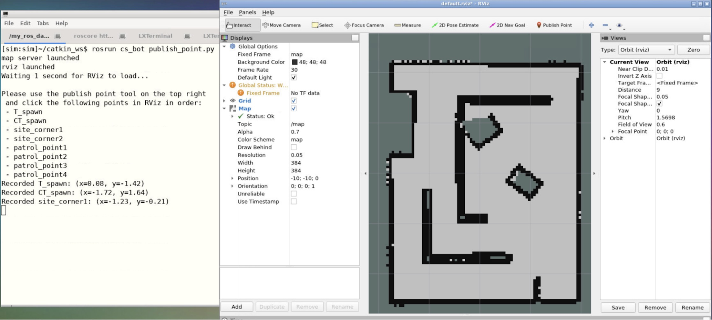
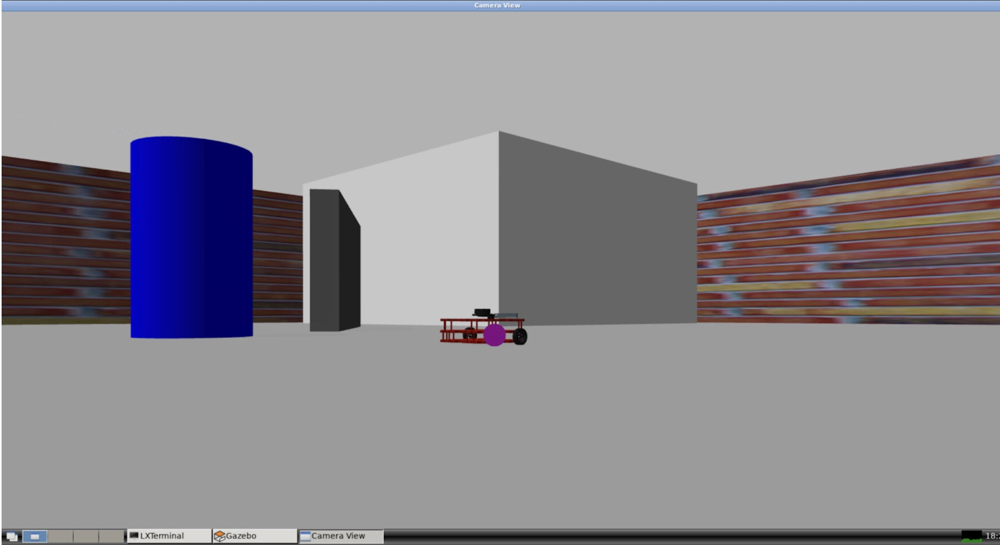

# Counter-Strike Bot

Github repo: https://github.com/HandsomeHarry/cs_bot

Harry Yu, Zared Cohen, TsonOn Kwok

## Introduction

Our goal was to create a robot simulation of the popular game franchise, Counter Strike, which is a first-person shooter game where teams of terrorists (Ts) and counter-terrorists (CTs) fight for their specific goals. The Ts must plant a bomb and defend it until detonation, and the CTs must eliminate all Ts or defuse the bomb if planted. If the round time runs out before either goal occurs, the CTs will be victorious. For our implementation, we created a 2v2 version of this game in a simulated environment (gazebo), and a 1v1 version in the real world. We also designed different personalities and guns for each robot (player), which provides a more realistic simulation of the game with an unpredictable outcome.

### Problem statement (objectives)
- Robots can detect enemy teams and shoot 
- Robots can successfully navigate the course and avoid obstacles/other robots
- Server node manages player health, game state, bomb site locations
- Communication between local (robot) nodes and server node 

## What was created
1. There are a few groups of tasks we had to work on:
the gazebo world simulation
2. The creation of the map using SLAM, how bomb site locations, patrol points and spawn points are defined. This must be done manually.
3. AMCL that allows the robots to navigate and avoid obstacles
4. Personalities of robots, robot actions when situations change using FSMs (very complicated)
5. Modularized launch files to be used when needed

### Files Overview

| **File/Component** |  **Node** | **Topic** | **Messages** | **Description** |
|---------------------------|-------------------------------------------------------------------------------|--|--| - |
| **world3.world**         ||| | A gazebo world map. Simplified version of Inferno, a site in Counter-Strike. |
| **publish_point.py**       | point_recorder | Subscriber | /clicked_point | Tool for generating map configuration points.  |
|                           |||| - Records clicked points in RViz for map setup.                              |
|                           |||| - Saves spawn points and bomb site locations to CSV.|
|                           |||| - Launches map server and RViz for point selection.                          |
|                           |||| - Used during the map setup/configuration phase.                             |
| **map_manager.py**        | map_manager | Publisher | /game/map_markers| Loads and manages map configuration from CSV files.                           |
|                           | | Publisher | /game/map | - Handles bomb site locations and spawn points.                               | 
|                           |||| - Publishes visualization markers for map features.                          |
|                           |||| - Creates RViz markers for bomb sites and spawn locations.                   |
|                           |||| - Manages map coordinate system and point conversions.                       |
| **game_manager.py**      | game_manager | Publisher | /game/state | The central server node that manages the game state.                         |
|                           | |Subscriber | /game/robot_states | - Handles round timers, bomb events, and robot health.                       |
|                           | |Subscriber | /game/shoots |- Publishes game state updates to all robots.         |Subscriber | /game/bomb_events |
|                           |||| - Manages combat events and damage calculations.                             |
|                           |||| - Tracks dead players and round winners.                                     |
|                           |||| - Controls round phases (PREP, ACTIVE, BOMB_PLANTED).                        |
| **robot_controller.py**   | cs_robot_controller | Publisher | /{robot_name}/cmd_vel |  Base class for all robot behaviors.                                          |
|                           | | Publisher | /game/robot_states | - Handles movement, combat, and state management.                            |
|                           | | Publisher | /game/shoot | - Processes visual detection of enemies.                                     |
|                           | | Subscriber| /{robot_name}/camera/image_raw | - Manages navigation and pathfinding.                                        |
|                           | | Subscriber| /map | - Interfaces with ROS navigation stack.                                      |
|                           | | Subscriber| /{robot_name}/robot_state | - Parent class for personality-specific behaviors.                           |
|                           | | Subscriber| /game/state | |
| **CT_normie.py, T_aggressive.py, etc.** | ct_normie_controller | | | Child classes of `robot_controller.py`. Inherits all combat management and specific behavior. |
| **gun.py**                | | | | Defines weapon types and their characteristics (rifle, sniper, SMG).         |
|                           | | | | - Manages weapon properties like damage, fire rate, and accuracy.            |
|                           | | | | - Handles ammo management and reload timers.                                 |
|                           | | | | - Provides shooting mechanics with accuracy calculations.                    |
|                           | | | | - Returns damage values based on successful hits.                            |


## How to Run the Game (in Gazebo)

### Building the Environment
---
1. Ensure the `transitions` library is installed:
   ```
   pip3 install transitions
   pip3 install pandas
   ```
2. Navigate to your catkin workspace:
   ```
   cd <your-catkin-workspace>
   ```
3. Build the workspace:
   ```
   catkin_make
   ```
   If no error messages appear, proceed to the next step.

### Generating the Map
---
We need a robot to explore the map using SLAM to manually generate the world map for later use.

1. **Launch SLAM** using `gmapping` by running the following command:
   ```
   roslaunch turtlebot3_slam turtlebot3_slam.launch slam_methods:=gmapping
   ```

2. Open a new terminal and control the robot with the keyboard:
   ```
   roslaunch turtlebot3_teleop turtlebot3_teleop_key.launch
   ```
   Drive the robot around the target area to scan its surroundings.

3. Once the entire target area has been scanned, open another terminal and save the map:
   ```
   rosrun map_server map_saver -f `rospack find cs_bot`/maps/<map_name>
   ```
   This will generate two files: `<map_name>.yaml` and `<map_name>.pgm` in the `cs_bot/maps` directory.

### Defining Areas
---
We will define the bomb sites using our script and `rviz`.

1. Run the following command:
   ```
   rosrun cs_bot publish_point.py
   ```

2. Click on the map according to the prompt. The results will be saved to `points.csv`.

The coordinates saved in `points.csv` can be used by other nodes later.




### Launch Game
---
Run the game by launching 2v2_scenario.launch, which launches all the nodes required including launching 4 robots and starting the game server node:
```
roslaunch cs_bot 2v2_scenario.launch
```



## Story of the Project:
This was an ambitious and challenging project that required the team to pivot multiple times to achieve successful completion. Our initial concept was to create a complex 2v2 robot gunfight game, with a server node managing critical elements such as health, player location, game state, round timer, alongside player-side hit detection to simulate real-world game mechanics. While the idea appeared straightforward in theory, implementing server-based gunfight mechanics proved unreliable, with inaccuracies in hit detection leading to significant challenges. This prompted our first pivot: shifting from server-based hit detection to relying solely on the shooter robot’s perception of its enemy for accuracy.

Implementing shooting mechanics was another major hurdle. The robots' cameras were mounted on their undersides, which complicated aiming while moving. Adjustments required the gun's angle to align dynamically with the target, introducing numerous variables, such as gun_angle, enemy_to_center_angle (calculated using OpenCV), and current_speed. These complexities made fine-tuning exponentially harder. To address this, we simplified the shooting mechanic by fixing the gun’s aim to the robot’s center of view. While this reduced the computational burden, it required robots to remain stationary while shooting—a limitation reminiscent of the strategic elements in the original Counter-Strike game.

Our second pivot involved adapting the real-world implementation. Due to high demand for the lab’s robots and the logistical challenges of running four robots simultaneously, we transitioned from a 2v2 format to a 1v1 demo for the physical implementation. A full 2v2 version was instead demonstrated in the simulation environment using Gazebo. This compromise allowed us to showcase the core mechanics effectively while accounting for resource constraints and fine-tuning time.

